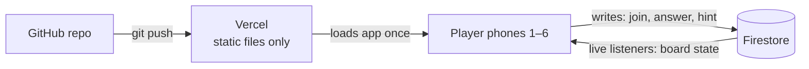

# Mayday Protocol — Game Design

**Status:** design agreed, ready to start building · **Last updated:** 2026-09-11
**Prototype (look & feel only):** https://claude.ai/code/artifact/edc94180-0f9a-497d-acea-e1da078c2885
**Related:** [puzzle-system.md](puzzle-system.md)

## Concept

A real-time co-op escape room played through a shared web link. One person hosts, gets a crew code, and 1–6 players join from their phones. The crew works through a story-driven mystery against a countdown. Puzzles run in parallel, clues are split between players, and scripted events add pressure. It ends with a score and funny awards, not just "escaped / didn't escape".

It started as a Claude Artifact (see the original session export). This repo is its standalone home, because the Artifact's shared-database feature only works inside one organization, and we want **anyone with the link** to be able to play.

## Decisions so far

| Topic                         | Decision                                                                                                                                                        | Why                                                                                 |
| ----------------------------- | --------------------------------------------------------------------------------------------------------------------------------------------------------------- | ----------------------------------------------------------------------------------- |
| Who can play                  | Anyone with the link, no account                                                                                                                                | Main reason for leaving the Artifact version                                        |
| Crew size                     | 1–6 players                                                                                                                                                     | Solo must work too (see "Solo play" below)                                          |
| Themes                        | Launch with one: **space station** ("Mayday Protocol"). "Missing CEO" is a candidate second theme. Theme picker later                                           | Themes are content packs (story + puzzle text + palette), separate from engine code |
| Length                        | Quick Run (5 systems, ~12 min) · Full Shift (8, ~20 min) · Deep Space (12, ~32 min)                                                                             | Kept from the original version                                                      |
| Hints                         | Free and unlimited, no time lost. Each hint takes a small bite out of the final score                                                                           | Keeps the icebreaker feel, but the score still means something                      |
| When the timer hits 0:00      | The game ends with a "station lost" debrief: score for what was solved, awards still handed out                                                                 | Keeps the pressure real without anyone "losing"                                     |
| Talking to each other         | No in-game chat in v1. The crew is in the same room or on a call                                                                                                | Split-information puzzles are meant to be talked through; chat can come later       |
| Dropped phones / late joiners | Anyone can rejoin with the crew code and keeps their progress. Late joiners are allowed until the game ends. If the host leaves, host passes to the next player | Phones lock and networks drop; nobody should get stuck                              |
| Language                      | English only for v1                                                                                                                                             |                                                                                     |
| Accessibility                 | Alert levels use text and icons as well as color; sound is optional                                                                                             | Red / amber / teal alone isn't enough for color-blind players                       |
| Hosting                       | Vercel (free)                                                                                                                                                   | Static files only, deploys on every push                                            |
| Realtime data                 | Firebase Firestore (free tier)                                                                                                                                  | Live listeners, no server of our own to run                                         |
| Visual direction              | Dark space-station control panel; teal / amber / red alert levels                                                                                               | See prototype                                                                       |
| Devices                       | Phones and laptops are both first-class. Each screen has a phone layout and a laptop layout that uses the extra width                                           | Crews will mix phones and laptops, especially on a call                             |
| Puzzles                       | Code-generated puzzles plus a written bank; new every run. Live AI later, if the game grows                                                                     | See [puzzle-system.md](puzzle-system.md)                                            |

## Design pillars

1. **One central mystery.** Every puzzle feeds a story: the previous crew vanished and the module purges when the timer hits zero.
2. **Parallel, not linear.** 3–4 systems are open at once so nobody just watches one phone.
3. **Split information.** Some players get private intel that others need, so the crew has to talk.
4. **Timed story beats.** New info with ¾ of the time left, the twist at half, emergency mode at a quarter. Fractions scale with every shift length; see [story-space-station.md](story-space-station.md#story-beats).
5. **A twist.** The objective gets reframed partway through.
6. **Score + awards.** Time left, systems solved, hints, teamwork bonus; awards like Mastermind, Eagle Eye, Comms MVP.
7. **Co-op, no losers.** The crew plays against the clock, not against each other.

## Explicitly out of scope (for now)

- Physical-room mechanics (UV light, props, hidden compartments). They don't translate to phones.
- Puzzles that need exact simultaneous taps on several phones. Too fragile over mobile networks; maybe later.
- Rigid job roles (Detective / Hacker / Leader…). Too heavy for 1–6 casual players; we use lightweight "you hold this intel" instead.

## Solo play

With one player, split-information puzzles show every fragment on the one screen. The engine needs a "merge splits" path from day one, not as an afterthought.

## Screens (from the prototype)

1. **Home**: host or join, pick shift length
2. **Lobby**: crew code, who's joined, host launches
3. **Mission board**: timer, alert level, open / solved / locked systems
4. **System screen**: puzzle, answer box, free hint, private intel panel
5. **Pressure event**: full-screen alert and story reveal
6. **Debrief**: score breakdown and awards

## Stack

| Job            | Tool                            | What it teaches                                    |
| -------------- | ------------------------------- | -------------------------------------------------- |
| UI             | React + TypeScript + Vite       | Component structure, typed state                   |
| Styling        | Tailwind CSS                    | Utility-first styling                              |
| Animation      | Motion (formerly Framer Motion) | Declarative animation for unlocks, reveals, alerts |
| Realtime state | Firebase Firestore              | Document modeling, live listeners, security rules  |
| Identity       | Firebase Anonymous Auth         | Name-only join with a stable user id               |
| Hosting / CI   | Vercel + GitHub                 | Push-to-deploy pipeline                            |

## Architecture



There's no custom backend. Vercel only serves files; each phone talks straight to Firestore, which pushes every change to all connected phones.

### Data model (draft)

```
rooms/{crewCode}
  theme, difficulty, seed, status (lobby | playing | ended)
  startedAt, hostId
  systems: { [systemId]: { state: open | solved | locked, solvedBy, solvedAt } }
  hintsUsed, firedEvents[]

rooms/{crewCode}/players/{uid}
  name, color, joinedAt, solvedCount

rooms/{crewCode}/intel/{uid}        ← private: rules allow read only if request.auth.uid == uid
  fragments[]
```

> Firestore security rules work **per document**, not per field. Private intel must live in its own document per player; a hidden field on the player doc isn't possible.

### Known trade-offs

- **Answers live on the client.** With seeded puzzle generation, anyone reading the JS can work out the answers. That's fine for a casual co-op game; we can store hashes instead of plain answers to stop casual peeking.
- **Free-tier limits.** Firestore's free tier has daily read/write limits. That's plenty for friend-group games, but check the current limits before sharing widely.

## Before we start building

These need you (they involve creating accounts, which Claude can't do). Step-by-step guide: [setup.md](setup.md).

- [x] A **GitHub** account and an empty repo for `tp-escape`
- [x] A **Firebase** project (free Spark plan) with Firestore and Anonymous Auth turned on
- [x] A **Vercel** account (sign up with GitHub), connected to the repo

How we'll write the code: [engineering.md](engineering.md).

## Build plan

Each stage ends with something playable, and each one teaches something new.

| Stage                      | What gets built                                                                                             | What you learn                                                   |
| -------------------------- | ----------------------------------------------------------------------------------------------------------- | ---------------------------------------------------------------- |
| **1. Pipeline** ✅         | Empty React + TypeScript + Tailwind app, deployed to Vercel on every push                                   | Project setup, CI/CD                                             |
| **2. Solo game** ✅        | Seeded puzzle generators, mission board, answer checking, timer, debrief. All on one phone, no Firebase yet | Components, state, seeded randomness, pure functions             |
| **3. Multiplayer**         | Crew codes, joining, live sync, rejoin, first-correct-answer-wins. Plan: [multiplayer.md](multiplayer.md)   | Firestore modeling, live listeners, transactions, anonymous auth |
| **3½. Sound**              | Timer ticks in the last minute, alert chimes, solve/wrong tones, win/lose stings, a mute button             | Web Audio API (sounds generated in code, no audio files)         |
| **4. Co-op and story**     | Private intel, split puzzles, timed story beats, the twist, the random-traitor finale                       | Security rules, event scheduling                                 |
| **5. Polish and playtest** | Animations, awards, real playtest with 2+ phones                                                            | Motion (animation library)                                       |
| **Later**                  | Theme picker, more puzzle types, live AI puzzles                                                            | Serverless functions, LLM APIs                                   |

## Still to write (content, not code)

- The story outline for the space station: what happened, the suspects, the twist, the story beats. Needed by stage 4. **Draft:** [story-space-station.md](story-space-station.md)
