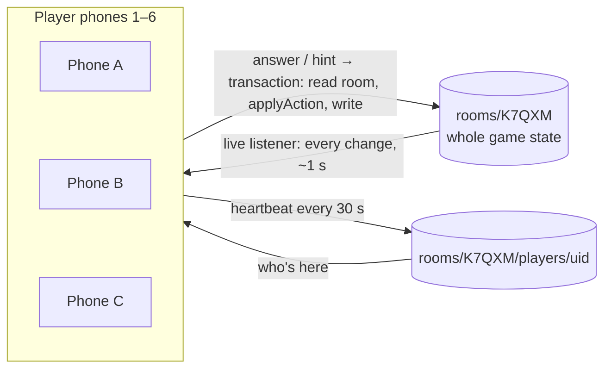

# Multiplayer — Stage 3 Plan

**Status:** agreed · **Last updated:** 2026-09-11
**Related:** [game-design.md](game-design.md) · [engineering.md](engineering.md) · [puzzle-system.md](puzzle-system.md)

## Goal

A crew of 1–6 plays **one shared game from their own phones or laptops**. The host creates a crew, the others join with a link or a code, and everyone sees the same board live. Anyone can work on any open system, and when someone solves one, it updates on every screen within about a second.

**Next idea, not built:** live shared controls — one player turns a dial, another watches a meter move in real time. Design and costs: [live-controls.md](live-controls.md).

**Tested end to end:** `npm run test:e2e` plays a real crew game in two browsers against the emulators — host, join, launch, solve, and a split puzzle with one piece on each screen. It runs on every pull request.

**Not in stage 3:** private intel and split puzzles, story beats, the traitor finale (all stage 4); the rest of the sound (alert chimes and solve/wrong tones) shipped in stage 3½; named awards (stage 5). **Play solo** keeps working exactly as it does today, with no Firebase and no network needed.

## How it plays

1. **Host:** Home → **Host a crew** → pick shift length → enter a name → **lobby** with the crew code (`K7QXM`) and a share link (`tp-escape-deploy.vercel.app/c/K7QXM`).
2. **Crew:** open the link (or **Join with code**) → enter a name → the lobby shows everyone who's in.
3. **Host taps Launch.** Every screen switches to the board at the same moment, with the same timer.
4. **Anyone solves anything.** Each system card shows who's working on it (a small "Ravi" tag), so the crew can split up. Solving a system updates every screen, with a toast: _"Ravi restored Life Support."_
5. **Debrief for everyone**, showing who restored what. **Play again** keeps the same crew and code: everyone goes back to the lobby together, and the host launches the next round.

Late joiners can join mid-game. A phone that locks or drops rejoins automatically when it comes back.

**Host powers:** Launch, Play again, and **pause for everyone**. Nobody can remove players. When the host pauses, every screen shows the paused view with _"Paused by Mansi"_, and only the host can resume. If the host drops out while paused, the next host can resume.

## Architecture



The screens don't change. Stage 2 built them against the `GameStore` interface; stage 3 adds a `FirestoreStore` with the same shape.

### Decision: the room stores the whole game, and every move is a transaction

| Option                                                                                                                                                 | Verdict    | Why                                                                                                                                                                                                |
| ------------------------------------------------------------------------------------------------------------------------------------------------------ | ---------- | -------------------------------------------------------------------------------------------------------------------------------------------------------------------------------------------------- |
| **A. Room holds the full game state; each answer or hint is a transaction that runs the same `applyAction` as solo play**                              | **Chosen** | Reuses the engine unchanged. The transaction guarantees two players answering at the same instant can't overwrite each other: the first correct answer wins, and the second sees it already solved |
| B. Room holds only the seed and progress; each phone regenerates the puzzles from the seed (the original idea in [puzzle-system.md](puzzle-system.md)) | Rejected   | If we deploy mid-game, a phone that loaded the old version would generate **different puzzles** from everyone else. The whole state is only a few KB, so there's no need to save space             |
| C. An action log that every phone replays                                                                                                              | Rejected   | Needs careful ordering and more reads, for no benefit at our size                                                                                                                                  |

**Trade-off:** any player's device could, in theory, write a fake state (cheat). That's fine for friends. The rules still check that only crew members can change a room.

### Data model

```
rooms/{code}
  code, difficultyId, createdAt (server time)
  playerUids: string[]          ← who's in the crew, max 6 (the rules enforce this)
  status: 'lobby' | 'playing' | 'ended'
  game: GameState | null        ← the same object solo play uses
  round: number                 ← bumps on "Play again"

rooms/{code}/players/{uid}
  name (1–16 chars), color, joinedAt, lastSeen (server time)
  viewing: systemId | null      ← powers the "Ravi" tag on system cards
```

**The host isn't stored.** It's computed as the earliest-joined player seen in the last 60 seconds. So if the host's phone dies, the next person automatically becomes host, with no extra code or writes.

Because the host is computed rather than stored, the security rules can't check "only the host may pause"; the app enforces it by only showing the host the pause button. That's fine for friendly games, and it's the same trust level as the rest of the game state.

### Keeping the timer in sync

Phone clocks disagree by a few seconds, which is enough to make "00:03" on one phone and "00:00" on another. So the game's start time comes from **Firestore's server clock**. Each phone measures how far its own clock is from the server's once, using its first heartbeat, and corrects for it. Timers then match within about half a second.

### Presence

While the game is open, each phone updates its `lastSeen` every 30 seconds. Anyone not seen for 60 seconds shows as offline (dimmed) and can come back at any time.

### Crew codes

5 characters from 31 that can't be confused with each other (no `0/O`, `1/I/L`), giving about 28 million codes. A new room is created in a transaction that fails if the code is taken, and then retries. Anyone with a code can open that room, but **rooms can't be listed**, so nobody can browse other people's games.

### Security rules (tested against the Firebase emulator)

- Every request must be signed in (anonymous sign-in, no account).
- Rooms: read one if you have its code; **never list them**; create one only as yourself; change one only if you're in `playerUids`.
- Joining: add only yourself to `playerUids`, and only while it has fewer than 6 people.
- Player docs: write only your own; names 1–16 characters.
- Tests prove each of these: e.g. a 7th player is refused, and you can't rename someone else.

### Links

React Router with two routes: `/` and `/c/:code`. A `vercel.json` rewrite makes `/c/K7QXM` load the app when someone opens or refreshes the link. Without it, Vercel would return a 404.

### Free-tier cost

A 6-player, 10-minute Full Shift is roughly a few hundred writes and a couple of thousand reads, mostly from heartbeats. That's comfortably inside Firebase's free daily limits for friend groups (check the current limits in the console). The heartbeat interval is the main thing to turn down if we ever need to.

## PRs

| PR                 | What                                                                                                          | What you'd learn                                               |
| ------------------ | ------------------------------------------------------------------------------------------------------------- | -------------------------------------------------------------- |
| **3A** ✅ #13      | Firebase foundation: SDK, config from env, anonymous sign-in, local emulators, security rules and their tests | Env config, auth, rules as code, emulators                     |
| **3B + 3C** ✅ #14 | Rooms, lobby, share links, presence, the shared live game, name tags, toasts, host pause, another round       | Transactions, live listeners, routing, sync design, clock skew |
| **3D**             | Two-phone test: Playwright opens two browsers against the emulator and plays a game together                  | End-to-end testing of real-time features                       |

Released to the live site in #15 (2026-09-11). Crew play there stays switched off until the steps below are done.

## Switching crew play on for the live site

| Step                                                                                                                            | Who                                     | Status        |
| ------------------------------------------------------------------------------------------------------------------------------- | --------------------------------------- | ------------- |
| Publish `firestore.rules` to project `tp-escape` (`npm run deploy:rules`; `.firebaserc` points at it)                           | Claude, after your `npx firebase login` | ✅ 2026-09-11 |
| **Vercel → Settings → Environment Variables**: the six `VITE_FIREBASE_*` values from `.env.example`, for Production and Preview | You                                     |               |
| **Redeploy** in Vercel (the values are baked in when the site is built)                                                         | You                                     |               |
| **Firebase → Authentication → Settings → Authorized domains**: add `tp-escape-deploy.vercel.app`                                | You                                     |               |

Locally, `.env.local` holds the same values; without it, `npm run dev:crew` uses the emulators instead.

**Whenever `firestore.rules` changes**, publish it again with `npm run deploy:rules`, after the change is merged to `main`.

## Decisions (agreed 2026-09-11)

| Question             | Decision                                               |
| -------------------- | ------------------------------------------------------ |
| Show who's on what   | **Yes**: a name tag on each system card                |
| Play again           | **Same crew, same code**, back to the lobby together   |
| Host powers          | **Launch, Play again, and pause.** No removing players |
| Pause in multiplayer | **Only the host can pause, and it pauses everyone**    |
